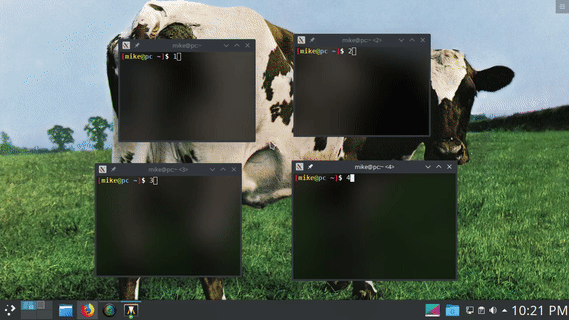
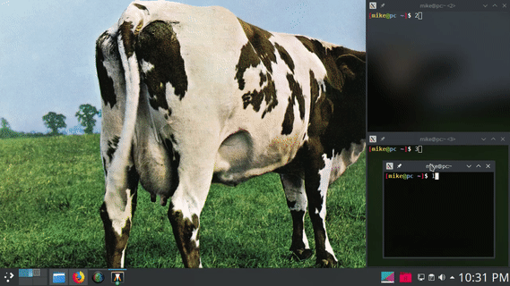

# KWin Quick Tile Enhancements
Enhancements for the [KWin](https://userbase.kde.org/KWin) Quick Tile feature.

[KDE Plasma](https://kde.org/plasma-desktop)'s window manager [KWin](https://userbase.kde.org/KWin) is chock full of features.
One feature that is not particularly fleshed out is Quick Tiling.
Quick Tiling uses a *keyboard shortcut* or *mouse gesture* to quickly tile
a window to a screen edge or screen corner.

Similar to window snapping in [ChromeOS](https://www.omgchrome.com/hidden-window-snap-resize-feature-chrome-os/), in
[Windows 10](https://www.youtube.com/watch?v=Bk8yTBLEj3c), and in
[GNOME Shell](https://www.youtube.com/watch?v=vfj5KjAm-LE).

## Features
1. Mouse friendly.
2. Tiled windows automatically resize together.
3. Smart tile placement.
4. Remembers and restores window sizes when untiled. ([Example](media/untiling-window.webm))
5. Prevent accidental window resize and movement when tiled. ([Example 1](media/prevent-resizing-accident.webm), [Example 2](media/prevent-moving-accident.webm))

## Examples
### Quadrant Tiling

### Smart Window Placement

## Installation
### Using the [KDE Store](https://store.kde.org/p/1309653) (recommended)
1. Open the `KWin Scripts` settings window (search for and open using [Krunner](https://userbase.kde.org/Plasma/Krunner) or [Kickoff (Application Launcher)](https://userbase.kde.org/Plasma/Kickoff)).
2. Click `Get New Scripts...`.
3. Search for `kwin quick tile enhancements`.
4. Click `Install`.

### Manual
1. Navigate to the [Releases](https://github.com/thetarkus/kwin-quick-tile-enhancements/releases/) page and download the latest `kwin-quick-tile-enhancements-*.kwinscript` file.
2. Open the `KWin Scripts` settings window (search for and open using [Krunner](https://userbase.kde.org/Plasma/Krunner) or [Kickoff (Application Launcher)](https://userbase.kde.org/Plasma/Kickoff)).
3. Click `Install from File...`.
4. Select the `*.kwinscript` file and click Apply.
(You may have to close and re-open the `KWin Scripts` settings window for the script
to appear in the list.)

## Usage
- Grab and drag a window to an edge or corner of the screen and then drop the window.
- Use a [Quick Tile Global Shortcut](#use-keyboard-shortcuts-to-quick-tile-windows) to tile a window to a screen edge or screen corner.

### Keyboard Shortcuts
All useful keyboard shortcuts to this script are located in the
*KWin* section of *Global Shortcuts* inside of the *System Settings*.
The easiest way to open this window is through [Kickoff (Application Launcher)](https://userbase.kde.org/Plasma/Kickoff) or
[Krunner](https://userbase.kde.org/Plasma/Krunner). Search for and open **`Global Shortcuts`**.

#### Use keyboard shortcuts to Quick Tile Windows
Set the shortcuts with the actions: `Quick Tile Window to the (...)` 
Default shortcuts are: `Meta+{Up,Down,Left,Right}` which tile to each respective
screen edge. 
Corner quick tile shortcuts must be set manually.

#### Use keyboard shortcuts to navigate between windows
Set the shortcuts with the actions: `Switch to Window (to the ...)` 
Default shortcuts are: `Meta+Alt+{Up,Down,Left,Right}` 
Setting Vim keys (`Meta+{H,J,K,L}`) is recommended.

## Warnings
- Multi-monitor support not tested.

## Alternatives
* [Sticky Window Snapping](https://github.com/Flupp/sticky-window-snapping) is a similar script that gives more granular control of window layouts but misses features 3, 4, and 5 from the [features list](#features) above.
* [Kröhnkite](https://github.com/esjeon/krohnkite) is an automatic tiling script based on [dwm](https://dwm.suckless.org/).
* [Tiling](https://store.kde.org/p/1112554/) is an automatic tiling script.
